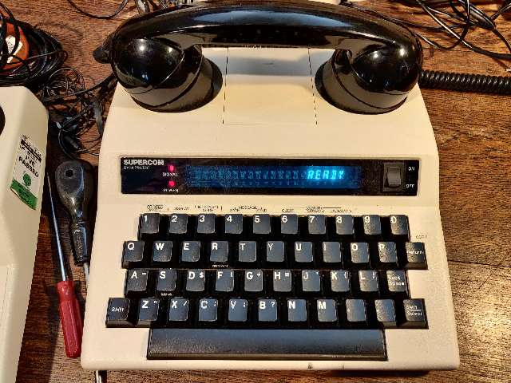
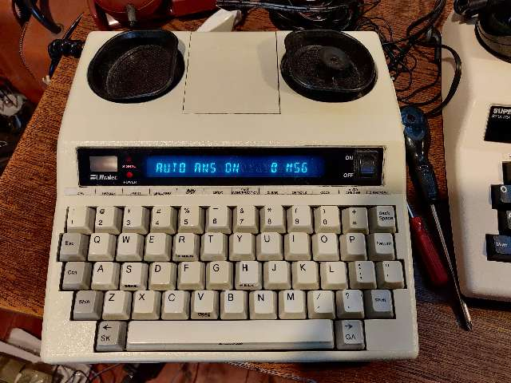

# Ultratec-Minicom

Support for Ultratec Minicom text telephones 

## Models

 * Supercom, Acoustic coupler only
 * Minicom 6000, Line modem and Acoustic coupler





[Minicom6000 manual](./docs/40tm6000.pdf)

## Asterisk gateway

Softmodem configuration similar to glasstty example here: https://glasstty.com/?page_id=1556

Softmodem component github here: https://github.com/johnnewcombe/asterisk-Softmodem

in this dialplan fragment calls to internal number 600 are processed by softmodem to be interpreted by a console application on TCP port 6503.

```
exten => 600, 1, NoOp() 
 same => n, Set(VOLUME(TX)=2)
 same => n, Set(VOLUME(RX)=2)
 same => n, Answer()
 same => n, Softmodem(localhost, 6503, ,v(V21)ld(8)s(1)) ; djrm Custom
 same => n, Hangup()
```


## Asterisk terminal

In a shell I have used the linux tool nc to echo what is typed on the minicom text typped locally when connected is sent to the minicom.

```
while true ; do nc -l -p 6503 ; done
```

# Other tools - wip

## Multimon-ng - program to decode radio transmissions

This program can be used to decode the audio received by a minicom device

```
 1510  multimon-ng -h
 1511  multimon-ng -s -a UFSK1200 qbf.wav
 1512  multimon-ng -s -a UFSK1200 -f qbf.wav
 1513  multimon-ng -s -a UFSK1200  qbf.wav
 1514  multimon-ng  -a UFSK1200  qbf.wav
 1515  multimon-ng -s -a UFSK1200  qbf.wav
 1516  multimon-ng  -c -a UFSK1200  qbf.wav -v 3
 1517  multimon-ng  -c -a UFSK1200  qbf.wav -v 0
 1518  multimon-ng  -c -a UFSK1200  qbf.wav -v 99
 1519  multimon-ng  -c -a UFSK1200 
 1520  multimon-ng 
 1521  multimon-ng  -h
 1522  multimon-ng  -c -a UFSK1200  - < qbf.wav
 1523  multimon-ng  -c -a UFSK1200  -v 0 - < qbf.wav
 1524  multimon-ng  -h
 1525  multimon-ng  -c -a CCIR  -v 0 - < qbf.wav
 1526  multimon-ng  -c -a CCIR  - < qbf.wav
 1527  multimon-ng  -c -a MORSE  - < qbf.wav
 1528  multimon-ng  -c -a SCOPE  - < qbf.wav
 1529  multimon-ng  -c -a SCOPE -a EAS  - < qbf.wav
 1530  multimon-ng  -c -a SCOPE -a UFSK1200  - < qbf.wav
```

The quick bron fox to playback into multicom device.
[qbf.wav](./qbf.wav)


## minimodem - general-purpose software audio FSK modem

```
 1491  minimodem -h
 1492  minimodem -r qbf.wav
 1493  minimodem -r -f qbf.wav
 1494  minimodem -r -f qbf.wav 300
 1495  minimodem -r -f qbf1.wav 300
 1496  minimodem -r -f untitled.ogg 300
 1497  minimodem -r -f qbf1.wav 300
 1498  minimodem -r -f untitled.ogg 300
 1499  minimodem -r -f untitled.ogg 
 1500  minimodem -r 50
 1501  minimodem -r 100
 1502  minimodem -r 300
 1503  minimodem -r 110
 1504  minimodem -r 100
 1505  minimodem -h
 1506  minimodem -r 50
 1507  minimodem -r rtty
 1508  minimodem -r ttd
 1509  minimodem -r tdd
 1544  minimodem --rx -5 50
 1545  minimodem --rx -5 100
 1546  minimodem --rx -5 300
 1547  minimodem --rx -5 45
 1548  minimodem --rx -8 45
 1549  minimodem --rx -7 45
 1550  minimodem --rx -7 50
 1551  minimodem --rx -7 100
```


